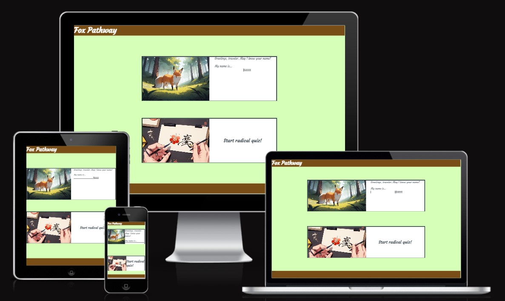
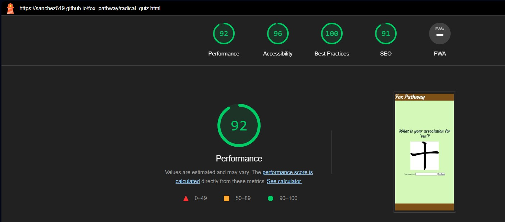
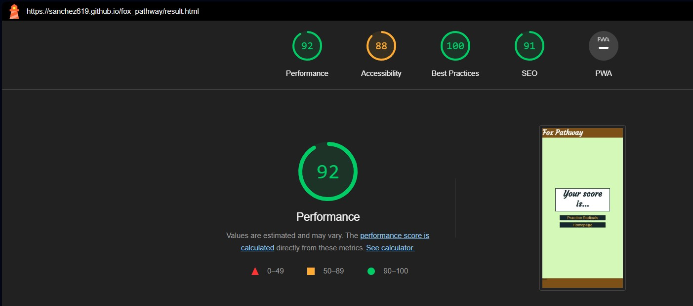
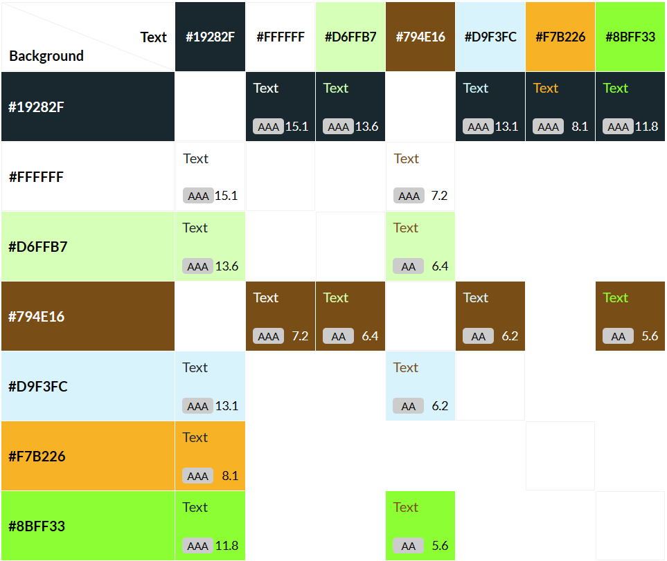
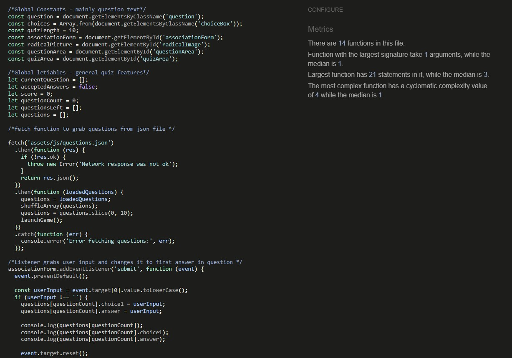
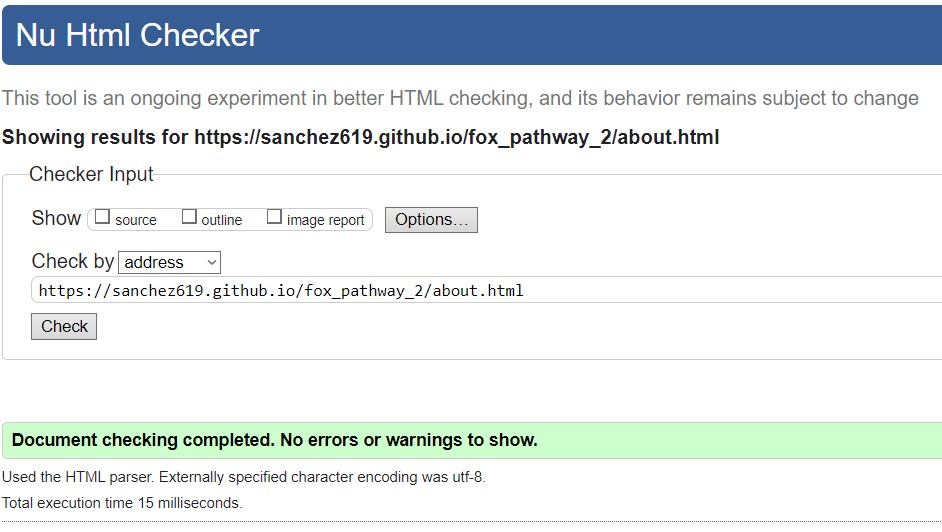
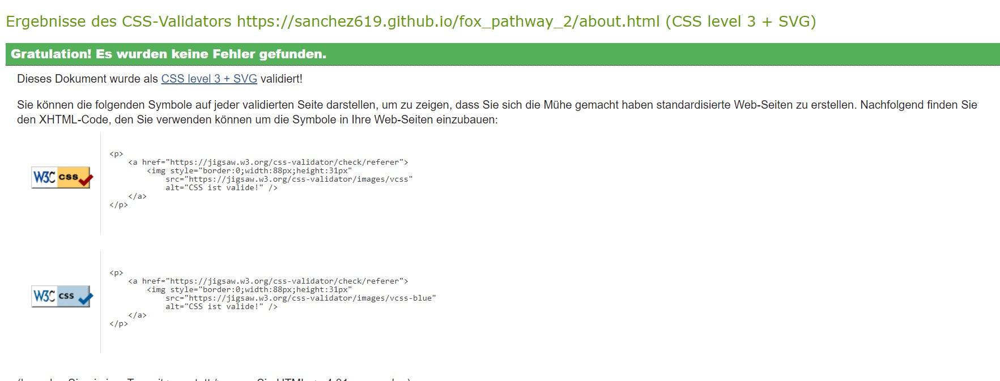

# Fox Pathway

## An introduction to a first quiz website for a Japanese Learning website

While doing the Code Institute program, my part-time work as a middle school instructor has proven less fruitful.
The beliefs and techniques regarding learning do not work well in an environment which forces students to learn, especially if they have not themselves learned that the process of acquiring knowledge is nowhere near as difficult as they imagine it to be.
While many teachers develop the habit of blaming the inability of students, I do not want to go down the same path. I believe in the principle which I have laid out on the Memory Gates website.
Thus, it seems only necessary to follow up directly on the website. This document will outline the follow-up website of Memory Gate – Fox Pathway.

## Index

1. [General Description](#general-description)
2. [Planning Stages](#planning-stages)
3. [General Page Features](#general-page-features)
4. [Individual Page Features](#individual-page-features)
5. [Testing](#testing)
6. [Future Improvements](#future-improvements)
7. [Credits](#credits)
8. [Special Thanks to](#special-thanks-to)

## General Description

Fox Pathway is a website which applies the idea of learning by association. The main principle will be Joshua Foer’s “See-Link-Go” principle.
A user sees the content, links it with their association and can remember it that way. As its main topic, Fox Pathway will provide a platform for users to learn Japanese Radicals.
These radicals make up a large majority of components used for building Japanese Kanji – especially the commonly used ones.
Many learners of Japanese simply gloss over this concept and learn each kanji character on its own.
From my perspective, this seems like a wasted opportunity. Learning kanji with classic rote learning is a demanding and tiring task.
After testing a more creative approach, I discovered that using the radicals as creative tool to associate meaning had a much bigger impact on my learning success.
With Fox Pathway, I want to create a first small gate for Japanese learners with similar issues to improve their learning experiences and reduce their frustrations.

### The aims of this website are to

* help the user gain an understanding for Japanese Kanji
* help users learn basic Radicals often used in Japanese writing.
* display the benefits of the See-Link-Go Principle for language learning.
* provide a platform to create and review the user’s association.

### The user of this website

* wants to learn Japanese.
* wants assurance that their language ability is enough to learn a language like Japanese.
* learns to use their own imagination for language learning.
* trains their creativity.

## Planning Stages

### Early Concepts

The idea of a learning platform for Japanese characters has been on my mind for much longer. In my mind, the best idea would be to keep a chart for all associations of the user and make them recall them gradually.
First, their task would be to recall the Japanese radicals. Styled in a quiz form, this would ensure that the user had a simple way to check and, if necessary, update their associations.
Second, the user would combine the different radicals in a selection of complete kanji. They create a story using the radicals as components.
Third. the user would then check whether the story is easy for them to recall. At this stage, I imagined this concept to be doable by using simple textboxes and comparing their content.

### Simplification

Unfortunately, due to both time constraints as well as conceptual boundaries, the kanji quiz ultimately was not developed further.
A platform for recalling an entire image to remember a kanji – the connection between the remembered radicals and a personalized image – is definitely a useful tool.
Unfortunately, no basic coding concepts that I could inquire allow for more than a simple testing of strings. The input would require more detailed function to make it intuitive for user usage.
While this idea is something that I want to work on in the future, it is not feasible at a level with basic JavaScript Code.

### End Concept

What my mentor and I lastly ended up on is an outline for a quiz focusing on the learning of radicals.
Including a table responsive for user input in itself proved to require lots of code for an array with many objects. In its form, even a rudimentary choice of objects would bloat the js files.
Thus, I made the decision to use a separate json.file, which would contain all information and provide a space to save the user input onto.
In hindsight, using the json.file effectively proved to be quite a challenge, but its implementation was necessary to make the website work while keeping the contents of the js.files to a minimum.

## General Page Features

While the style is very rudimentary, all webpages contain the following elements.

### Header

The header is styled as a brown div. It contains an a element styled as h1. When clicking on it, the user is connected back to the index element.

### Section

The section contains all content elements, aligned via a flex-direction. It is kept at a basic lightgreen. However, in a more advanced built, the background would contain hero elements in the originally conceptualized motifs (see Future Improvements).

### Footer

The footer would be the part of the page containing the links to the social media accounts. However, as Fox Pathway was conceptualized as a subsection of “Memory Gates”, my first project, it would technically only be a copy/paste of the code of the original page. I decided to keep the footer for styling purposes, but leave it empty in case of future updates.

## Individual Page Features

### index.html

The index site contains two divisions on a plain background.
The user chooses a username and enters it into a text. The name will then be used to ask the user to Cricket on the lower division to go to the radical quiz.
The second division is an a element style as a div, which leads to the radical_quiz.html.

### radical_quiz.html

The website contains two major elements. Only one is displayed at a time.

The first element consists of a division containing a question and a form. The user is asked to tell their association about a particular radical character. The user then writes that association into the input field.

* Each question also displays the respective character as image.
* The association will be set as solution in the single choice part.
  
The second element unveils itself as soon as the user has provided ten associations to the website. These association now appartement in a single choice quiz. Four divisions contain three possible solution. Should the user Pick one of these, the question will be marked as incorrect.
Correct and incorrect solutions are indcated with a green or red background.
Below the quiz, two clusters indicate the number of questions as well as the user’s score.

### result.html

The result page is kept to a bare minimum. A division displays the final score (the number of associations the user remembered correctly) and two a elements. These lead back to the other two webpages.

## Testing

The testing for the original website was done with Google Chrome, Mozilla Firefox and Opera.
The website was tested for screens between 280px and 1440px.
The website was tested with HTML, CSS Validators and JSHint.

A quick lighthouse check revealed a few minor issues regarding best practices and responsiveness. The lowest score occurred on the result page, mostly relating to the color and contrast choices. Ultimately, due to the progress on JavaScript code stalling at multiple times during the development, I saw no choice but to keep the webpages as is. However, the color choices are deliberate and would play into a more intricately style design of the website.
The color palette is as thus:

Regarding the JSHint, a misunderstanding popped up when testing.
At the time, I was unaware that JSHint checks for an older version of JS.
After finding out this fact, I reinstated all lets and consts that I removed.
Then, the code for rQuiz.js was cleaned up and validated without issues.

### Bugs

#### Targeting #score

When I first tried to apply the flexbox & Space around styles to the Div #score, the changes would not be implemented on the webpage.
While implementing the updateQuestionNumber function, the flexbox suddenly started applying. The space around style, on the other hand, was not applied.

Fix:
Additionally to the parent element, the element itself needed to be targeted in the js file, via "classList.remove".

#### Applying .hide

With the help of my mentor, I was able to apply the .hide class to two webpages. However, on radical_quiz.html, the association element would not disappear.
As it turns out, the id “radicalImage” is used on both index.html and radicalImage. This means that theeflex-displaz style.css file overrides the classes applied in rQuiz.css, as the idstyling takes precedence over .hide.

Fix: While the use of the element is a temporary fix, adding !important overrides the id-styling.

#### exchangeQuestion function – question targeting

A significant difference between the tutorial used for creating the website and then programming Fox Pathway was the consecutive uses of questions for two different elements. The repeated usage of questions for both receiving user input and the quiz usage would result in two major problems

* The question would not load in the Quiz Element of radical_quiz.html.
* The question would be stuck at the last question when entering the quiz.

Fix: Due to the interaction between the association form and the radical quiz, the positioning needed to be adapted.
Failing to account when to update the question lead to major issues, which I then adapted in a way that would order the questions correctly.
Unfortunately, there still seems to be an occasional bug where some questions show up multiple times despite the questions choices having changed. While the fixes were an overall improvement, there is still work to be done regarding exchangeQuestion.

### Changes to Second Version

#### Removal of unused constants

During planning for the project, I created a lot of possible constants.
The idea was to create as many factors that could be reused, like scores, inputs etc.
As a result, a few which turned out to be redundant, were not removed in the first build.
These are not included in this build.

#### Protection from empty inputs

To prevent empty inputs, a condition was added to the event listeners.
It checks whether the input is exactly not an empty string.
The else statement displays an alert questions and prevents the user from continuing.

#### Displaying user input correctly

During the first development issue, a general bug was not found.
It had to do with the currentQuestion[1].innerText.
In the original version, it targeted the input in a way that the question at the beginning would get the correct user input, but would display wrong user input at the end, most likely due to the interaction between the arrays.
By changing the value of currentQuestion[1].innerText, the bug was able to be fixed.
The program will now always target the input of currentQuestion so that no input can persist even though it is no longer on the questionIndex.

#### Buttons single-choice quiz

The buttons were initially programmed to react on a click on the choiceContent class.
This choice would prevent the user from clicking anywhere but the text.
In order to fix this, the constant choices was changed to target the choiceBox class.
Instead, the event listener was changed so that the choiceContent would still change.
Now, the player can click anywhere on the answers to choose their option.

#### About Page

On the index.html, an a-element was inserted in the division between the two visible division.
It links to a new about page, which displays basic info about how the game works.
Both websites were validated on HTML and CSS.

#### Smaller Fixes

While adjusting the styling for the index.html, I made some smaller fixes, especially with the borders.
These do not functionally change much, but they improve the display of the website on small devices.

### Deployment

The original version was posted to Github and written from Codeanywhere
The updated version was also deployed to Github from Gitpod.

To deploy the updated version, I started a new project.
I then imported the code in the settings from the starting  settings.
To deploy the website, I went to the settings and chose "pages".
There, I picked the main branch from "Deploy from a branch".

The site's hyperlink is: https://sanchez619.github.io/fox_pathway_2/

## Future Improvements

* Naturally, the selection of the website is limited due to time constraints. A full website will contain all radicals as well as a list of the 2000 most used Japanese Kanji.
* The styling is kept to a bare minimum, due to the focus of the project on JavaScript. Still, I would like to illustrate the general idea of a more thematic styling of the website. “Continuing the visual metaphor of the Torii Gate, Fox Pathway’s visuals are inspired by the famous “Fushimi Inari Taisha” (or 伏見稲荷大社). To non-Japanese, it is known as the famous temple mountain in Kyoto, where people wander on long paths, on which they pass through numerous smaller gates. Each gate is provided by companies and/or individuals; their names are engraved on the vertical pillars of the gates.”

* For learners already versed in Hiragana and Katakana, future version would include separate paths to learning the Japanese and Chinese reading for both the radicals and the kanji.
* In an ideal version, an AI generator could immediately generate a picture for the user’s association and save it in an array together with each input from the user.

## Credits

* Once more Joshua Foer’s Memory Superpowers serves as basis for the associative and mnemonic learning principles and techniques.
* As reference to how associative learning of Japanese characters may look, the German website Miruko.de has published two articles about learning the two other Japanese writing systems, one for Katakana and Hiragana respectively.
* All pictures this time will be AI generated to better suit the style of the website. The Generator used is perchance.org.
* Ui.div once more provided a platform to display a website in multiple screen formats
* As inspirations and guidelines for the quiz and the implementation of several features of the websites, two tutorials served as foundation.

1. Naturally, Love Math served as basic guide for the implementation of JavaScript and, more specifically, provided the blueprint for the score mechanic I decided to ultimately apply.
2. One of the most popular tutorials on quizzes, which also was recommended to me by my mentor, is the “Build a Quiz App” Series by James Q Quick. Most of the elements were adapted from this series and expanded on with the element of user input.

* The pictures, originally in svg-file-format, are provided by “Kanji Alive”, which are generous to provide an open-file Github repository for fonts, characters etc for open access.
* Once more, the Favicon was chosen from the supply of Favicon.net.
* As open resources for Japanese Kanji, the website "jisho.org" serves regulary as online dictionary for many English speaking learners of Japanese.

## Special Thanks to

* Richard Wells, my mentor who not only provided me with necessary sources, but also provided much mental assistance multiple times during the development process when I mentally hit rock bottom.
* Once more, a shoutout to all memory mentors and athletes, proving the power of associative thinking.
* A special thanks goes to “Kanji Alive” for providing the information and files for the implementation of Japanese radicals.
